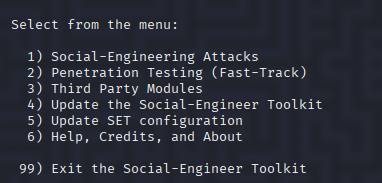
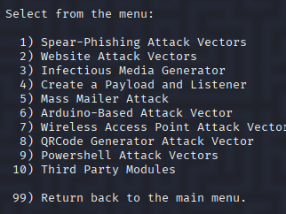
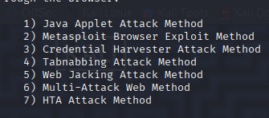
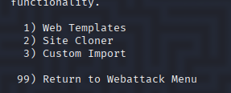
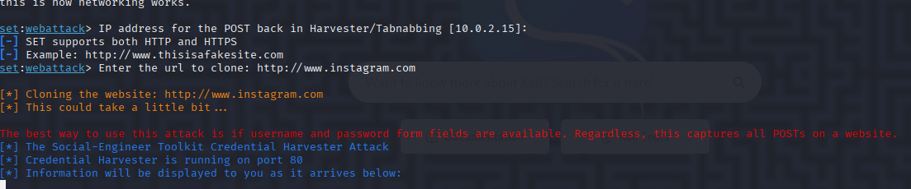
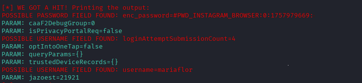

# Simulações de Phishing

## Configurando o Phishing no Kali Linux

Tipo de ataque: Social-Engineering Attacks

Vetor de ataque:  Web Site Attack Vectors

Método de ataque: Credential Harvester Attack Method 

Método de ataque: Site Cloner

Obtendo o endereço da máquina: local

URL para clone: http://instagram.com

## Resultado
